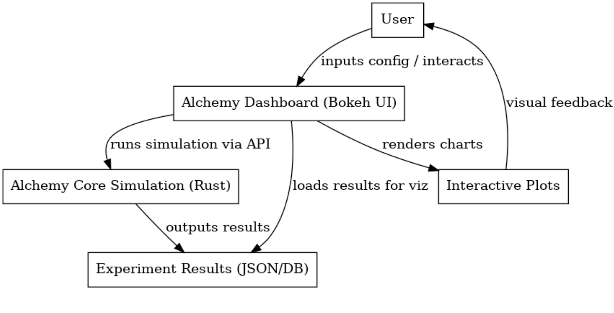

# AlChemy Chemistry

**AlChemy Chemistry** is a reimplementation of Walter Fontana’s *Alchemy* artificial chemistry, using lambda-calculus expressions as the “molecules” in a chemical soup. The core engine repeatedly “collides” lambda terms and applies reaction rules to produce new expressions, enabling studies of emergent behavior like expression diversity and population entropy over time. The system couples a high‑performance simulation core with an interactive Bokeh dashboard for configuring experiments and visualizing results.



---

## Key Components

- **Core Simulation (Rust, exposed to Python):**  
  Generates lambda expressions, applies reaction rules during random collisions, tracks outcomes, and writes results to disk.
- **Visualization Dashboard (Python + Bokeh):**  
  Lets users configure experiments, run/monitor simulations, and explore interactive plots of system dynamics (e.g., diversity, entropy).


---

## Repository Layout

```
alchemy_dashboard/
├── __init__.py
├── config.py
├── db_utils.py
├── main.py
├── models.py
├── plotting.py
├── simulation.py
├── static/
├── templates/
└── uploaded_configs/
```

> `uploaded_configs/` is a convenience folder for JSON experiment configs that the dashboard can load.  
> `db_utils.py` handles lightweight persistence (SQLite) for experiment metadata/results.

---

## Prerequisites

- **Rust toolchain** (stable) with `cargo` installed: <https://rustup.rs>
- **Python 3.10+** (3.11 recommended)
- **[uv](https://docs.astral.sh/uv/)** package manager (`pip install uv` or `brew install uv`)
- **maturin** (installed in the setup steps) to build the Rust extension


---

## Quickstart

### Recommended: uv-managed setup

1. **Clone the repository**

   ```bash
   git clone https://github.com/jjoseph12/Alchemy-Dashboard.git
   cd Alchemy-Dashboard
   ```

2. **Create the virtualenv and install dependencies with uv**

   ```bash
   # Optional: install a specific Python version
   uv python install 3.11

   # Create .venv and resolve dependencies listed in pyproject.toml
   uv venv
   source .venv/bin/activate          # Windows: .venv\Scripts\activate
   uv sync --dev                      
   ```

3. **Build & install the Rust chemistry core**

   ```bash
   # go to modern alchemy and download
   git clone https://github.com/mathis-group/Modern-AlChemy.git
   
   # run from the Rust crate directory (where Cargo.toml lives)
   uv run maturin develop --release
   ```

4. **Launch the dashboard**

   ```bash
   #install rust crate directly into dashboard venv
   uv run maturin develop --release --manifest-path /Users/jjoseph/Desktop/Projects/Modern-AlChemy/Cargo.toml

   # start dashboard
   uv run python -m alchemy_dashboard.main
   ```

   `uv sync` reads `pyproject.toml`, installs the required packages, and keeps `.venv` reproducible for teammates.

### Alternative: pip-based workflow

If you'd rather stick with vanilla `pip`:

1. **Create & activate a virtualenv**

   ```bash
   python3 -m venv venv
   source venv/bin/activate          # Windows: venv\Scripts\activate
   python -m pip install --upgrade pip
   ```

2. **Install tooling & dependencies**

   ```bash
   pip install maturin
   pip install flask bokeh pandas sqlalchemy
   ```

3. **Build & run**

   ```bash
   maturin develop --release
   python -m alchemy_dashboard.main
   # or: bokeh serve alchemy_dashboard --show
   ```

The dashboard will open in your browser and allow you to select or upload configs (e.g., from `uploaded_configs/`), launch simulations, and explore interactive plots.

---

## Using Experiment Configs

- Place JSON config files in `uploaded_configs/` or use the UI to upload.  
- Each config typically defines parameters for generating initial lambda terms, reaction rules, runtime (number of collisions/steps), and output options.
- Results are saved in JSON or SQLite (lightweight) form, which the dashboard loads for visualization.

---

## Data & Storage

- **SQLite:** Used for simple experiment cataloging and result indexing (via Python’s built‑in `sqlite3`).  
- **JSON:** Simulation outputs can also be written as JSON blobs which the dashboard can load for ad‑hoc analyses.

---

## Troubleshooting

- **Can’t import the core package?** Re‑run `maturin develop --release` from the Rust crate root inside your active virtualenv.  
- **Bokeh doesn’t open automatically?** Visit the printed local URL (e.g., http://localhost:5006/alchemy_dashboard) manually.  
- **Version mismatch:** Verify `python --version` and `rustc --version` are sane; upgrade `pip`.

---

## Acknowledgments

- Inspired by Walter Fontana’s *Alchemy* artificial chemistry.  
- Built with Rust, PyO3/maturin, and Bokeh.

---

## License
